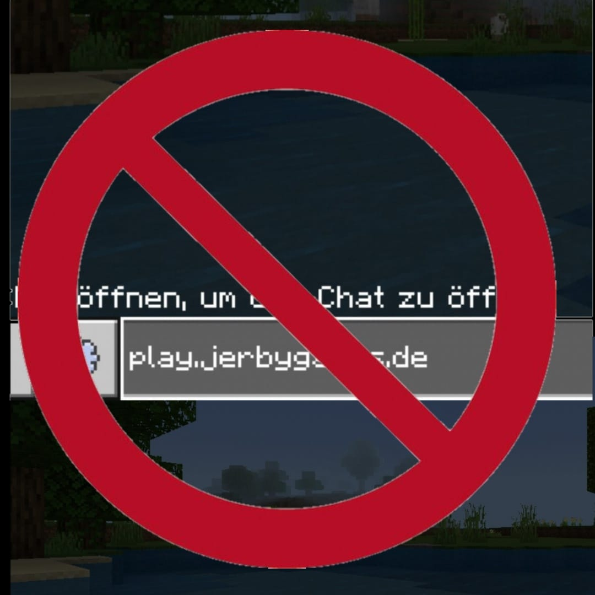

Do you want to ban words on your server?  
You don't know how?  
Then you can now ban words on your server.  
Simply write the forbidden words in config.yml and restart the server.  
   
How can I upload the plugin to the server?  
1.) Put the .phar file or the folder (requires the plugin "DevTools") in the plugins folder.  
2.) Restart the server.  
3.) Have fun!  
   
With questions or errors just over Discord on my server with me.  
Link: https://discord.gg/sPSquup

 

